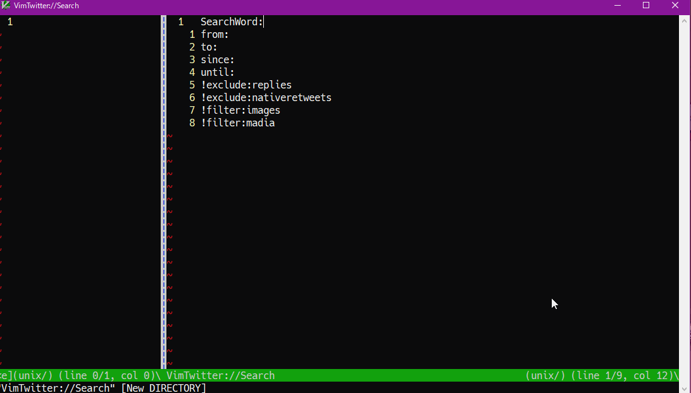

# VimTwitterSearch
毎回ツイッター(現X)の検索クエリを忘れるので作成されました。

## Requirements
[GitHub - vim-denops/denops.vim: 🜠 An ecosystem of Vim/Neovim which allows developers to write cross-platform plugins in Deno](https://github.com/vim-denops/denops.vim) 
[GitHub - tyru/open-browser.vim: Open URI with your favorite browser from your most favorite editor](https://github.com/tyru/open-browser.vim) 
が必要です。

## Usage

 
 TwitterSearch
 コマンドを使用することで、各種クエリが書き込まれたバッファーが開かれます。
 
 TwitterSearchOpen
 コマンドを使用することで、現在のバッファーの内容でブラウザを開きます。
 
 `g:VimTwitterSearchWords = []`
 を編集することで、バッファに書き込まれる内容が変化します。
 é…列内部㮠'SearchWord:' ã¯å¿…é ˆè¦ç´ ã§ã™ã€‚
 
 またオプションとして
 `g:VimTwitterSearchOptions = []`
 変数を指定することができます。
 filter:/include:/exclude:から始まる要素を格納します。
 接頭辞に!などを付けておくことでバッファーに含むが無視することができます。

## License
MIT

## Author
ambergon
